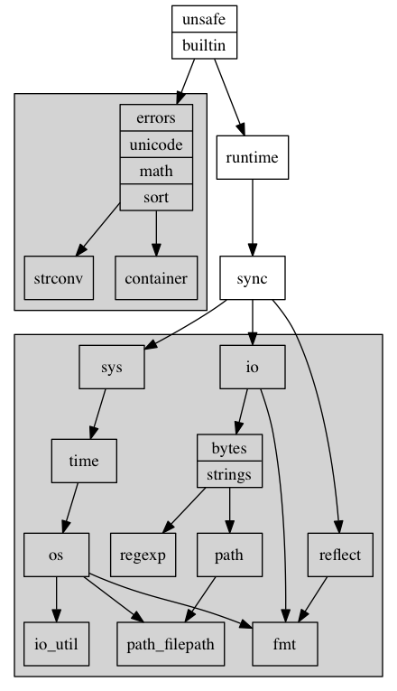

首先，要先梳理一下主要包间的依赖关系。runtime, sync, sys, time, os 这条线是我们最关心。这张图可以说是在预期内的，但明确它是有好处的, 减轻很多思考负担：

1. 比如可以明确推论出runtime里用系统调用都是内部实现的。实际也是如此，runtime调用系统(epoll, signal, mmap)调用不需要走go的func调用的逻辑（栈传参数等），上来直接操作寄存器。(runtime/sys_linux_amd64.s, netpoll 一节有例子)
2. 理解了一些子包的存在（io 和io/util）, 一大部分是为了解决依赖。
3. 左上方的框中的包是基础的，或基于interface的，没有依赖。

