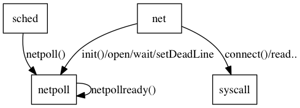
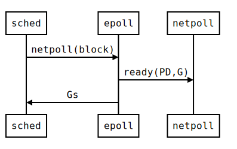

[TOC]


## 1. overview

普通的 网络操作要有以下几个层次：

1. net/net.go
2. net/fd_unix.go
3. net/fd_poll_runtime.go
4. runtime/netpoll_epoll.go
5. runtime/netpoll.go

其中 1 和 3 很薄，是对 2 和 4 简单包了一下。




1. net/fd_unix.go  
	* 通过syscall package完成，除了epoll外的系统调用，如read/write/connect/listen/accept
2. runtime/netpoll.go 
	* 对net: 提供 注册/wait/deadline等服务
	* 对runtime：通过 netpoll() 服务，提供ready的G
3. runtime/netpoll_epoll.go 
	* netpoll.go 的实现

从runtime 调度的角度:



## 2. netpoll


### overview

实现在 netpoll.go。 只用于网络操作。他要做三件事：


#### 向上: net

实现了声明在 net/fd_poll_runtime.go 的这组函数：

```
func runtime_pollServerInit()
func runtime_pollOpen(fd uintptr) (uintptr, int)
func runtime_pollClose(ctx uintptr)
func runtime_pollWait(ctx uintptr, mode int) int
func runtime_pollWaitCanceled(ctx uintptr, mode int) int
func runtime_pollReset(ctx uintptr, mode int) int
func runtime_pollSetDeadline(ctx uintptr, d int64, mode int)
func runtime_pollUnblock(ctx uintptr)
```

#### 向下： netpoll_epoll.go


* epoll要实现一组接口：

1. func netpollinit()
	* to initialize the poller
2. func netpollopen(fd uintptr, pd *pollDesc) int32
	* to arm edge-triggered notifications and associate fd with pd.
3. func netpollclose(fd uintptr) int32 
4. func netpollarm(pd *pollDesc, mode int)
5. func netpoll(block bool) *g
	* polls for ready network connections
	* returns list of goroutines that become runnable

* netpoll 提供一个回调的API， 用在 接口netpoll中

	`func netpollready(gpp **g, pd *pollDesc, mode int32)` 

#### 向内： runtime

调度器 用 `func netpoll(block bool) *g` 来进行调度

PS. 此外被用到的好像只有 netpollinited，其他函数都是自用，包括回调(netpollDeadline等)


### 核心结构 pollDesc

注释：

```
// pollDesc contains 2 binary semaphores, rg and wg, to park reader and writer
// goroutines respectively. The semaphore can be in the following states:
// pdReady - io readiness notification is pending;
//           a goroutine consumes the notification by changing the state to nil.
// pdWait - a goroutine prepares to park on the semaphore, but not yet parked;
//          the goroutine commits to park by changing the state to G pointer,
//          or, alternatively, concurrent io notification changes the state to READY,
//          or, alternatively, concurrent timeout/close changes the state to nil.
// G pointer - the goroutine is blocked on the semaphore;
//             io notification or timeout/close changes the state to READY or nil respectively
//             and unparks the goroutine.
// nil - nothing of the above.
```

定义：


```
const (
	pdReady uintptr = 1
	pdWait  uintptr = 2
)

// Network poller descriptor.
type pollDesc struct {
	link *pollDesc // in pollcache, protected by pollcache.lock

	// The lock protects pollOpen, pollSetDeadline, pollUnblock and deadlineimpl operations.
	// This fully covers seq, rt and wt variables. fd is constant throughout the PollDesc lifetime.
	// pollReset, pollWait, pollWaitCanceled and runtime·netpollready (IO readiness notification)
	// proceed w/o taking the lock. So closing, rg, rd, wg and wd are manipulated
	// in a lock-free way by all operations.
	// NOTE(dvyukov): the following code uses uintptr to store *g (rg/wg),
	// that will blow up when GC starts moving objects.
	lock    mutex // protects the following fields
	
	fd      uintptr
	closing bool
	seq     uintptr // protects from stale timers and ready notifications
	
	rg      uintptr // pdReady, pdWait, G waiting for read or nil
	rt      timer   // read deadline timer (set if rt.f != nil)
	rd      int64   // read deadline
	
	wg      uintptr // pdReady, pdWait, G waiting for write or nil
	wt      timer   // write deadline timer
	wd      int64   // write deadline
	
	user    uint32  // user settable cookie
}
```


### lazy init once

net/fd_poll_runtime.go

```	
var serverInit sync.Once
func (pd *pollDesc) Init(fd *netFD) error {
	serverInit.Do(runtime_pollServerInit)
	ctx, errno := runtime_pollOpen(uintptr(fd.sysfd))
	if errno != 0 {
		return syscall.Errno(errno)
	}
	pd.runtimeCtx = ctx
	return nil
}
```

```
//go:linkname net_runtime_pollServerInit net.runtime_pollServerInit
func net_runtime_pollServerInit() {
	netpollinit()
	atomicstore(&netpollInited, 1)
}

```


## 2.epoll 实现

全局唯一的 epoll descriptor


```
var (
	epfd           int32 = -1 // epoll descriptor
	netpolllasterr int32
)
```

### 系统调用


runtime/defs_linux_amd64.go
```
type epollevent struct {
	events uint32
	data   [8]byte // unaligned uintptr
}
```


```
// int32 runtime·epollcreate(int32 size);
TEXT runtime·epollcreate(SB),NOSPLIT,$0
	MOVL    size+0(FP), DI
	MOVL    $213, AX                        // syscall entry
	SYSCALL
	MOVL	AX, ret+8(FP)
	RET

// int32 runtime·epollcreate1(int32 flags);
// func epollctl(epfd, op, fd int32, ev *epollEvent) int
// int32 runtime·epollwait(int32 epfd, EpollEvent *ev, int32 nev, int32 timeout);
```


## 上层 net/fd_unix.go

### netFD

```
// Network file descriptor.
type netFD struct {
	// locking/lifetime of sysfd + serialize access to Read and Write methods
	fdmu fdMutex

	// immutable until Close
	sysfd       int
	family      int
	sotype      int
	isConnected bool
	net         string
	laddr       Addr
	raddr       Addr

	// wait server
	pd pollDesc
}
```

### Read()


```
func (fd *netFD) Read(p []byte) (n int, err error) {
	if err := fd.readLock(); err != nil {
		return 0, err
	}
	defer fd.readUnlock()
	if err := fd.pd.PrepareRead(); err != nil {
		return 0, err
	}
	for {
		n, err = syscall.Read(fd.sysfd, p)
		if err != nil {
			n = 0
			if err == syscall.EAGAIN {
				if err = fd.pd.WaitRead(); err == nil {
					continue
				}
			}
		}
		err = fd.eofError(n, err)
		break
	}
	if _, ok := err.(syscall.Errno); ok {
		err = os.NewSyscallError("read", err)
	}
	return
}


```

### accept 
```
func (fd *netFD) accept() (netfd *netFD, err error) {
	if err := fd.readLock(); err != nil {
		return nil, err
	}
	defer fd.readUnlock()

	var s int
	var rsa syscall.Sockaddr
	if err = fd.pd.PrepareRead(); err != nil {
		return nil, err
	}
	for {
		s, rsa, err = accept(fd.sysfd)
		if err != nil {
			nerr, ok := err.(*os.SyscallError)
			if !ok {
				return nil, err
			}
			switch nerr.Err {
			case syscall.EAGAIN:
				if err = fd.pd.WaitRead(); err == nil {
					continue
				}
			case syscall.ECONNABORTED:
				// This means that a socket on the
				// listen queue was closed before we
				// Accept()ed it; it's a silly error,
				// so try again.
				continue
			}
			return nil, err
		}
		break
	}

	if netfd, err = newFD(s, fd.family, fd.sotype, fd.net); err != nil {
		closeFunc(s)
		return nil, err
	}
	if err = netfd.init(); err != nil {
		fd.Close()
		return nil, err
	}
	lsa, _ := syscall.Getsockname(netfd.sysfd)
	netfd.setAddr(netfd.addrFunc()(lsa), netfd.addrFunc()(rsa))
	return netfd, nil
}
```

### accept

```

func (fd *netFD) connect(la, ra syscall.Sockaddr, deadline time.Time) error {
	// Do not need to call fd.writeLock here,
	// because fd is not yet accessible to user,
	// so no concurrent operations are possible.
	switch err := connectFunc(fd.sysfd, ra); err {
	case syscall.EINPROGRESS, syscall.EALREADY, syscall.EINTR:
	case nil, syscall.EISCONN:
		if !deadline.IsZero() && deadline.Before(time.Now()) {
			return errTimeout
		}
		if err := fd.init(); err != nil {
			return err
		}
		return nil
	case syscall.EINVAL:
		// On Solaris we can see EINVAL if the socket has
		// already been accepted and closed by the server.
		// Treat this as a successful connection--writes to
		// the socket will see EOF.  For details and a test
		// case in C see https://golang.org/issue/6828.
		if runtime.GOOS == "solaris" {
			return nil
		}
		fallthrough
	default:
		return os.NewSyscallError("connect", err)
	}
	if err := fd.init(); err != nil {
		return err
	}
	if !deadline.IsZero() {
		fd.setWriteDeadline(deadline)
		defer fd.setWriteDeadline(noDeadline)
	}
	for {
		// Performing multiple connect system calls on a
		// non-blocking socket under Unix variants does not
		// necessarily result in earlier errors being
		// returned. Instead, once runtime-integrated network
		// poller tells us that the socket is ready, get the
		// SO_ERROR socket option to see if the connection
		// succeeded or failed. See issue 7474 for further
		// details.
		if err := fd.pd.WaitWrite(); err != nil {
			return err
		}
		nerr, err := getsockoptIntFunc(fd.sysfd, syscall.SOL_SOCKET, syscall.SO_ERROR)
		if err != nil {
			return os.NewSyscallError("getsockopt", err)
		}
		switch err := syscall.Errno(nerr); err {
		case syscall.EINPROGRESS, syscall.EALREADY, syscall.EINTR:
		case syscall.Errno(0), syscall.EISCONN:
			return nil
		default:
			return os.NewSyscallError("getsockopt", err)
		}
	}
}
```

### setDeadline


net/fd_poll_runtime.go

```

func (fd *netFD) setDeadline(t time.Time) error {
	return setDeadlineImpl(fd, t, 'r'+'w')
}

func (fd *netFD) setReadDeadline(t time.Time) error {
	return setDeadlineImpl(fd, t, 'r')
}

func setDeadlineImpl(fd *netFD, t time.Time, mode int) error {
	d := runtimeNano() + int64(t.Sub(time.Now()))
	if t.IsZero() {
		d = 0
	}
	if err := fd.incref(); err != nil {
		return err
	}
	runtime_pollSetDeadline(fd.pd.runtimeCtx, d, mode)
	fd.decref()
	return nil
}
```


## 杂

#### epoll普通实现

syscall/ztypes_linux_amd64.go

```
type EpollEvent struct {
	Events uint32
	Fd     int32
	Pad    int32
}
```

syscall/zsyscall_linux_amd64.go

```
func EpollCreate(size int) (fd int, err error) 
func EpollCreate1(flag int) (fd int, err error) 
func EpollCtl(epfd int, op int, fd int, event *EpollEvent) (err error) 
func EpollWait(epfd int, events []EpollEvent, msec int) (n int, err error) 
```
