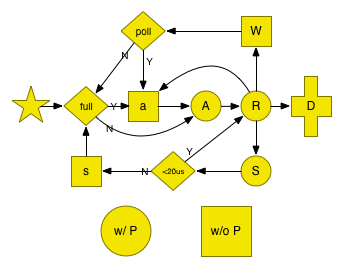

1. 调度谁？即停一个G后跑哪个G? [schedule](#:whoisnext)

     1. [P 状态](#pstats)
     2. [G 状态](#gstats)
	 3. [状态迁移图](#change_graph)
2. [调度时机，即什么时候停、停谁？](#when)
	3. sysmon, 抢占 （syscall block > 20us； running > 10 ms）
	4. epoll
	5. syscall
	6. futex (sleep/Lock internal)
	7. chan
	8. syncSema (sync包:mutex, cond..， rwmutex (write-preferring))
	9. timer
9. 


# [调度谁？即停一个G后跑哪个G?](id:whoisnext)

这个简单, 先说

## schedule()：

P的工作就是：不停的找G，跑之


1. _g_ := getg()
2. 需要trace 一下unblock事件？
3. 跑一下 GCWorker?（前提 gcBlackenEnabled）
4.  globrunqget (schedule每执行61次，跑一下这个)
5. runqget (local)
6. findrunnable() // blocks until work is available
	1. local
	2. global
	3. netpoll(false) // non-blocking
	4. runqsteal //random steal from other P's， 4 x \#P 次
	5. 如果在GC mark phase，参与到并发的mark过程中去
	6. releasep() //  Disassociate p and the current m.
	7. pidleput(_p_) // Put p to on _Pidle list.
	8. 再查一遍
	9. stopm() //Stops execution of the current m until new work is available.
		1. mput()
		2. notesleep
7. execute(gp, inheritTime)

	
	

### [P 状态](id:pstats)


	_Pidle   
	_Prunning 
	_Psyscall
	_Pgcstop
	_Pdead

### [G 状态](id:gstats)


	_Gidle            = iota // 0
	_Grunnable               // 1 runnable and on a run queue
	_Grunning                // 2
	_Gsyscall                // 3
	_Gwaiting                // 4
	_Gdead                   // 6
	_Genqueue                // 7 Only the Gscanenqueue is used.
	_Gcopystack              // 8 in this state when newstack is moving the stack
	// the following encode that the GC is scanning the stack and what to do when it is done
	
	
	_Gscan = 0x1000 // atomicstatus&~Gscan = the non-scan state,
	_Gscanrunnable = _Gscan + _Grunnable //  0x1001 When scanning completes make Grunnable (it is already on run queue)
	_Gscanrunning  = _Gscan + _Grunning  //  0x1002 Used to tell preemption newstack routine to scan preempted stack.
	_Gscansyscall  = _Gscan + _Gsyscall  //  0x1003 When scanning completes make it Gsyscall
	_Gscanwaiting  = _Gscan + _Gwaiting  //  0x1004 When scanning completes make it Gwaiting
	_Gscanenqueue = _Gscan + _Genqueue //  When scanning completes make it Grunnable and put on runqueue

### [状态迁移图](id:change_graph)
下图是go1.2时画的：
    


```
A: runnable
R: running
S: syscall
W: waiting
```

# [调度时机，即什么时候停、停谁？](id:when)


	

## sysmon

```
	forcegcperiod := int64(2 * 60 * 1e9)
	scavengelimit := int64(5 * 60 * 1e9)
	while True:
		usleep(delay)
		if not polled for more than 10ms:
			gp := netpoll(false) // non-blocking ,返回一个list！
			injectglist(gp) // 全部加入globalrunq，如果有idle的P，startm
		retake(now) // retake P's blocked in syscalls 
		 			// preempt long running G's
		if 超过 forcegcperiod 没有gc:
			injectglist(forcegc.g)
		if lastscavenge+scavengelimit/2 < now：
			mHeap_Scavenge(int32(nscavenge), uint64(now), uint64(scavengelimit)
			
```


* 注意 mHeap_Scavenge只在此处被自动触发
	* 除非user 调用debug.FreeOSMemory())
* 但是malloc有时好像会是否少量span。


#### 概括一下：


1. run every / 20 us
2. try retake / 20(us)
1. netpoll every / 10ms (nonblocking)
2. gc / 2分钟
1. free os mem / 5分钟


### forcegchelper 

从开始一直在跑，虽然名字中有“force”，但是普通的并发 gc(gcBackgroundMode)

```
func init() {
	go forcegchelper()
}
func forcegchelper() {
	startGC(gcBackgroundMode, true)
}
```

##  preemption

retake() 只在sysmon 被调用

```
for each _p_:
	s := _p_.status
	if s == _Psyscall:
		if it's there for more than 1 sysmon tick (at least 20us):
	 		handoffp(_p_)
	elif s == _Prunning:
		if 跑了超过 10 ms：
			preemptone(_p_)
				gp.preempt = true
				gp.stackguard0 = stackPreempt

```
注释云：

1. best-effort
2. The actual preemption will happen at some point in the future

这里的时机是 newstack (// Called from runtime·morestack when more stack is needed.):

```
preempt := atomicloaduintptr(&gp.stackguard0) == stackPreempt
if preempt:
	gopreempt_m(gp) // never return
		goschedImpl
			dropg
			globrunqput(gp)
			schedule()
```

	// We are interested in preempting user Go code, not runtime code.
	// If we're holding locks, mallocing, or preemption is disabled, don't
	// preempt.


	
## blocking syscall

请先看 [syscall](syscall.md) , 这里主要关注 runtime·entersyscall 和 runtime·exitsyscall， 还是在runtime/proc1中。

```
//go:nosplit
//go:nowritebarrier
func save(pc, sp uintptr) {
	_g_ := getg()

	_g_.sched.pc = pc
	_g_.sched.sp = sp
	_g_.sched.lr = 0
	_g_.sched.ret = 0
	_g_.sched.ctxt = nil
	_g_.sched.g = guintptr(unsafe.Pointer(_g_))
}

```
	 	
	 
### futex
	sleep/Lock internal

## netpoll
	
	socket, pipe
##  chan
##  syncSema （count may < 0）
	
	mutex, cond
	
## timer

