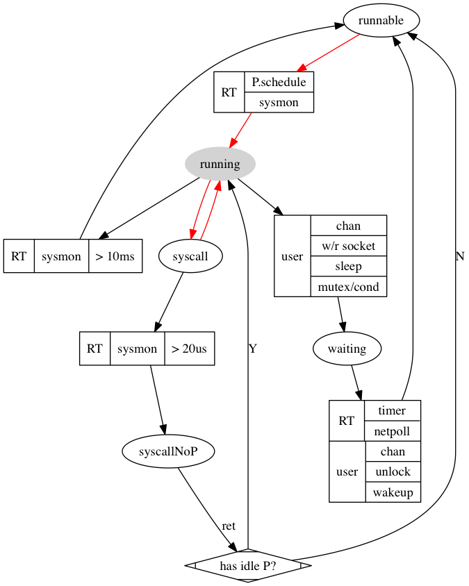

[TOC]


# schedule: overview


## G的状态

调度意味着两件事：

1. 一些G要主动或被动的停下来。意味执行了阻塞操作，或者被抢占。
2. 找可以跑的G跑起来。

就至少 running 和 block 两个状态，

因为cpu优先，running的优先，所以必须有个runnable状态。这导致上面两件事是可以分开处理的。

因为G可能很多，不能所有的block和unblock都用系统调用，runtime代理之。 所以block分成syscall和waiting两个状态。

整体上是三个状态

1. 停 running -> block
	1. 主动 
		1. 调用了阻塞的系统调用  -> syscall
			1. 比如read
		2. runtime内完成的
			2. G之间同步操作，不用系统调用（除了用futex在RT内部同步）
				1. chan
				2. sync.*
			3. 批处理，只在一处做系统调用
				1. 网络IO
				2. timer相关操作
	2. 被动 （被sysmon强占）
2. 启 runable -> running 
	1. sysmon()
	2. P.schedule()
3. block -> runable
	2. syscall -> runable 
		1. 被sysmon强占 （注意：这不是“好”事）
	3. 等待的事件发生
		1. 批处理处理到了自己
		2. 等的其他G有反应了
		


## 系统调用的处理

分几种情况：

1. 系统调用本身不阻塞，G的状态不会变化
2. 阻塞
	1. runtime内部，来真的：futex
	2. “批处理”： epoll和futex（用于timer）
	3. 用户的阻塞系统调用：如果完成的快，就直接返回runing状态接着跑。否则会被抢占(下图中的syscallNoP)。

比如读socket，会先尝试非阻塞的读，如果没读到，就进入waiting状态，交给epoll来处理。
		
##### syscall时被强占

系统调用执行时间超过20us可能会被sysmon把P夺走，在系统调用返回后要如果找不的P，就只能到runable状态。syscallNoP的情况，虽然没有P，但是会占用真实的系统线程（比如启动很多G读stdin）。

### 效率和公平

1. 从效率讲，G少时红色是最希望的场景，无浪费，G多时要看抢占的代价和调度的实现；而调度公平取决于： 1. sysmon合理的抢占 2.scheule()的选择策略


图例：

0. 椭圆表示状态: running, runnable, waiting, syscall, syscallNoP。
1. 方框表示操作: RT和user表示操作的发起者





1. 调度谁？即停一个G后跑哪个G? [schedule](#:whoisnext)

     1. [P 状态](#pstats)
     2. [G 状态](#gstats)
	 3. [状态迁移图](#change_graph)
2. [调度时机，即什么时候停、停谁？](#when)
	3. sysmon, 抢占 （syscall block > 20us； running > 10 ms）
	4. epoll
	5. syscall
	6. futex (sleep/Lock internal)
	7. chan
	8. syncSema (sync包:mutex, cond..， rwmutex (write-preferring))
	9. timer
9. 
	
	
	
### entersyscall


TODO:不值得单独一节奏

请先看 [syscall](stack.md) , 这里主要关注 runtime·entersyscall 和 runtime·exitsyscall， 还是在runtime/proc1中。

```
//go:nosplit
//go:nowritebarrier
func save(pc, sp uintptr) {
	_g_ := getg()

	_g_.sched.pc = pc
	_g_.sched.sp = sp
	_g_.sched.lr = 0
	_g_.sched.ret = 0
	_g_.sched.ctxt = nil
	_g_.sched.g = guintptr(unsafe.Pointer(_g_))
}

```


## 附：

### [G 状态](id:gstats)

```
	_Gidle            = iota // 0
	_Grunnable               // 1 runnable and on a run queue
	_Grunning                // 2
	_Gsyscall                // 3
	_Gwaiting                // 4
	_Gdead                   // 6
	_Genqueue                // 7 Only the Gscanenqueue is used.
	_Gcopystack              // 8 in this state when newstack is moving the stack
	// the following encode that the GC is scanning the stack and what to do when it is done
	
	
	_Gscan = 0x1000 // atomicstatus&~Gscan = the non-scan state,
	_Gscanrunnable = _Gscan + _Grunnable //  0x1001 When scanning completes make Grunnable (it is already on run queue)
	_Gscanrunning  = _Gscan + _Grunning  //  0x1002 Used to tell preemption newstack routine to scan preempted stack.
	_Gscansyscall  = _Gscan + _Gsyscall  //  0x1003 When scanning completes make it Gsyscall
	_Gscanwaiting  = _Gscan + _Gwaiting  //  0x1004 When scanning completes make it Gwaiting
	_Gscanenqueue = _Gscan + _Genqueue //  When scanning completes make it Grunnable and put on runqueue

```

### [P 状态](id:pstats)


	_Pidle   
	_Prunning 
	_Psyscall
	_Pgcstop
	_Pdead

